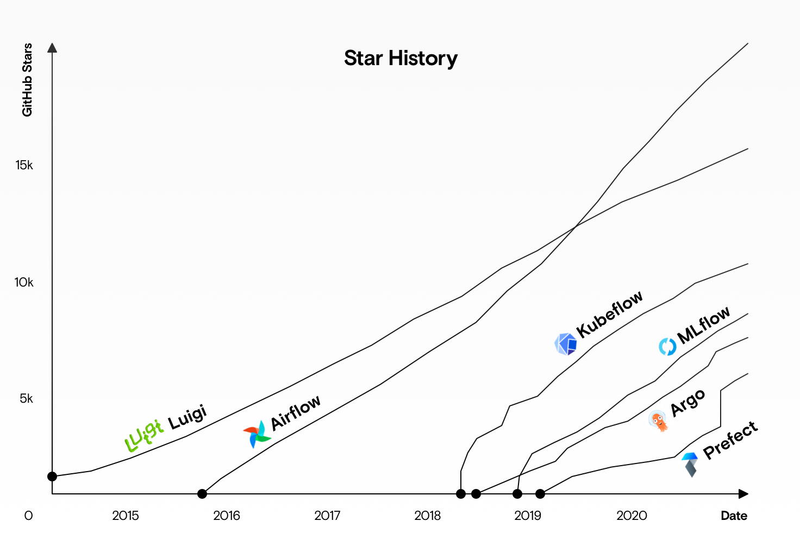
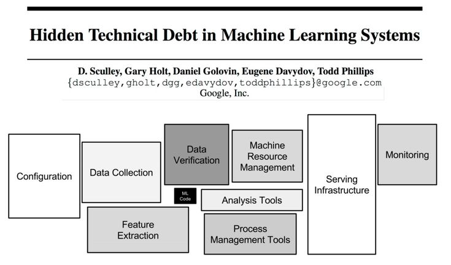
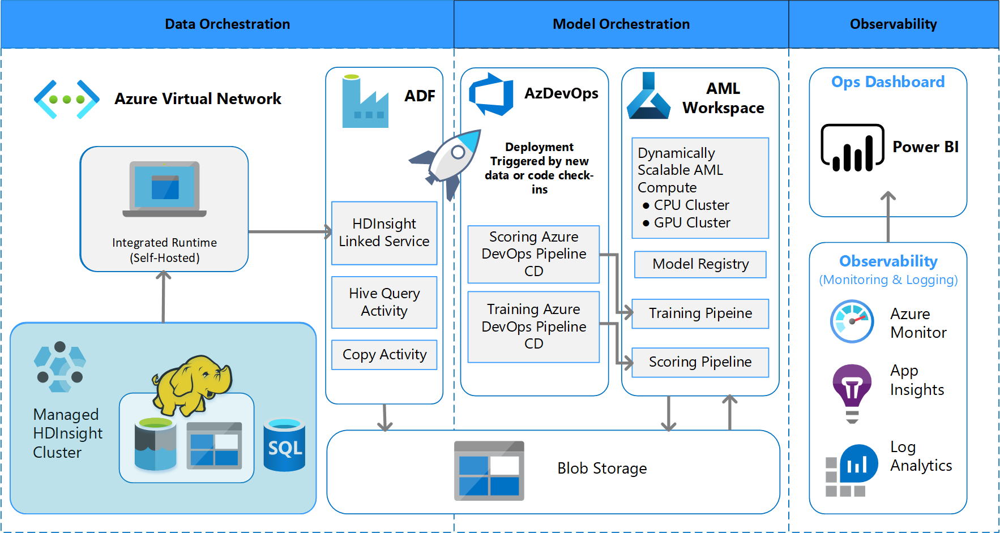

# mlops-cheatsheet
* options

* The ml code is actually very small

* Microsoft has its solution

# Reference
* [microsoft ml ops](https://docs.microsoft.com/en-us/azure/architecture/example-scenario/mlops/mlops-technical-paper)
* [Full Stack Deep Learning](https://fullstackdeeplearning.com/spring2021/lecture-6/)
* [Article](https://towardsdatascience.com/from-models-to-deployment-learn-mlops-for-free-from-google-and-stanford-experts-b24e7018c13d)

